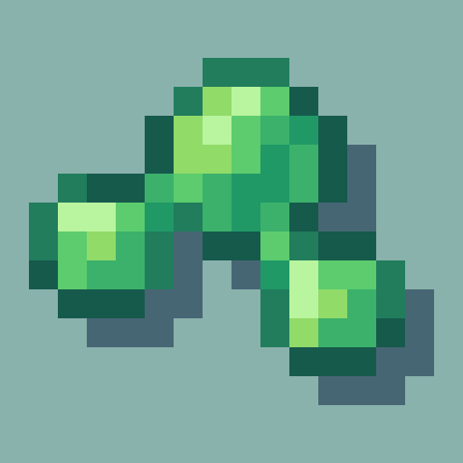

# Visuality

Visuality is a Minecraft mod for fabric loader. This is a simple client-sided cosmetic mod that will add a bunch of new
particles such as crystal sparkles, particles on mob hitting, custom blob particles for slimes, environmental particles
to your Minecraft world. Expect particles collection expanding with the mod updates!

#### [Discord Server](https://discord.gg/DcemWeskeZ) | [Modrinth Page](https://modrinth.com/mod/visuality) | [CurseForge Page](https://curseforge.com/minecraft/mc-mods/visuality)

## Configuration

You can configure the mod by editing visuality.json in the config folder of your Minecraft directory or simply through
ModMenu integration.
